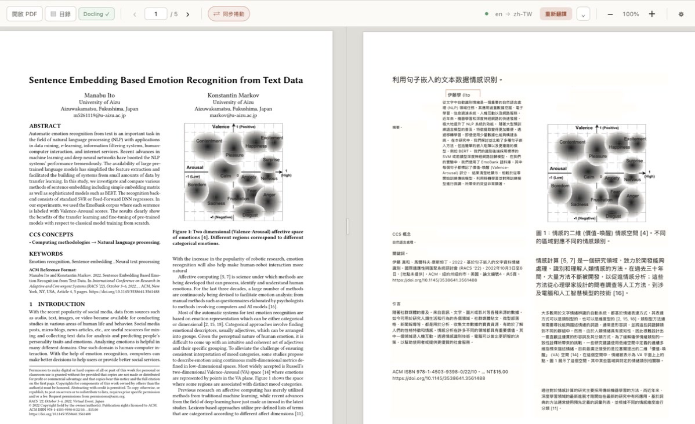

# LingoPane

[繁體中文](README.md) | [English](README.en.md)

A macOS PDF reader centered on side-by-side reading of source text and translations. Built with Tauri 2, React, TypeScript, and PDF.js, LingoPane connects to oMLX, Ollama, or any OpenAI-compatible endpoint while preserving the original PDF layout and synchronizing reading positions locally.

## Application Preview



The original PDF remains on the left while translated content is rendered at the corresponding page coordinates on the right. Page navigation, in-page reading position, and zoom can stay synchronized across both panes. The toolbar follows the reading workflow, grouping document, outline, layout analysis, navigation, synchronized scrolling, translation, and zoom controls for direct comparison of multi-column papers, figures, captions, and paragraphs.

## Current Status

- Open and parse local PDF files
- Lazy-render PDF pages instead of drawing the entire document at once
- Side-by-side source and translation panes
- Draggable center divider
- Page navigation, previous/next controls, and 50–200% zoom
- Bidirectional synchronized scrolling based on page number and in-page position
- Settings for oMLX, Ollama, and generic OpenAI-compatible endpoints
- Source and target language settings
- Model discovery and connection testing through `/v1/models`
- Current-page translation through `/v1/chat/completions`
- API keys stored in macOS Keychain, never in localStorage
- Stable PDF text block IDs grouped by line spacing, columns, and font size
- Translated text overlaid at original coordinates while preserving images, table lines, and backgrounds
- Translation response shape and block ID validation
- Cross-page translation queue with sequential page processing, progress display, and stop controls
- Basic translated-text overflow detection and automatic font shrinking
- Switchable PDF.js fast analysis and Docling standard-pipeline enhanced analysis
- Docling runtime probing, versioned analysis contract, top-left coordinate normalization, and automatic PDF.js fallback
- Docling headings, paragraphs, captions, and table blocks connected to the existing translation and overlay flow
- Current-page-first Docling analysis in five-page batches, with results available after each batch and real worker termination
- SQLite persistence for per-page PDF.js/Docling layouts and translations, restored when the same document is reopened
- A configurable recent-document cache that keeps 30 documents by default and supports 1–500 without storing the original PDFs

The main remaining work includes truly aborting in-flight backend HTTP requests, explicitly warning when text still overflows at the minimum font size, and expanding automated coverage for multi-column and table layouts.

## Docling Layout Analysis Integration Roadmap

### Goals and Technical Decisions

LingoPane is integrating [Docling](https://github.com/docling-project/docling) as an optional enhanced-analysis layer for better recognition of two-column papers, tables, captions, headers and footers, scanned pages, and complex reading order. PDF.js remains responsible for immediate preview, native text, and precise coordinates. oMLX, Ollama, or another OpenAI-compatible endpoint is responsible only for local text translation.

Planned principles:

- Do not replace PDF.js rendering with Docling; combine the strengths of both.
- Use only Docling's official Python runtime and standard pipeline, including its PDF parser, layout analysis, table structure, and OCR.
- Do not convert Heron, TableFormer, or other Docling models to oMLX, and do not make oMLX responsible for document analysis.
- Use selective OCR only for scanned pages, damaged text layers, or low-confidence layouts.
- Keep Docling and its models runnable locally; do not send PDFs to cloud services by default.
- Do not integrate MarkItDown. Its Markdown output cannot be mapped reliably back to PDF coordinates and does not fit the core requirement of preserving the original page layout.
- Do not bundle Python, PyTorch, and all Docling models directly into the main App DMG until the quality gains have been validated.

### Planned Architecture

```text
Local PDF
├─ PDF.js: immediate rendering, native text, glyph masks, and precise coordinates
└─ Docling worker: reading order, block types, hierarchy, tables, OCR, and confidence
       │
       └─ Rust layout adapter: coordinate normalization and PDF.js/Docling alignment
              │
              └─ Translation Units: headings, paragraphs, captions, table cells, and context
                     │
                     ├─ oMLX / Ollama: local translation
                     ├─ SQLite: analysis and translation cache
                     └─ React overlay: translated text at original coordinates
```

LingoPane defines its own versioned `DocumentAnalysis` format so React does not depend directly on Docling's JSON schema. Each analysis block includes at least the document hash, page number, block type, text, reading order, top-left-origin bounding box, hierarchy, confidence, and whether it is translatable. Stable IDs are derived from the PDF hash, analyzer/model version, page number, block reference, and normalized text.

### TODO and Acceptance Criteria

#### 1. Build a Layout Benchmark Suite

- [ ] Collect repeatable single-column, two-column, spanning-title, table, caption, formula, and scanned-PDF fixtures.
- [ ] Create manually verified golden data for reading order, block types, table cells, and non-translatable regions.
- [ ] Produce a comparison report between the current PDF.js rules and the Docling standard pipeline.

Acceptance: every layout-algorithm change can automatically show differences in reading order, block classification, table completeness, and missing text.

#### 2. Docling Prototype and Local Service Boundary

- [x] Build a minimal standalone Python worker so React does not depend directly on the Docling API.
- [x] Add runtime probing and Python, Docling, worker, and schema version reporting.
- [x] Use the standard pipeline with layout and table structure enabled, and make OCR configurable.
- [x] Add analysis IDs, current-page-first page-range batches, per-batch progress events, and real worker termination.
- [ ] Split initial model download/loading and document analysis into more detailed progress states.
- [ ] Record analysis duration, peak memory, model download size, and failure reasons.

Acceptance: on an Apple Silicon Mac, test PDFs can be analyzed fully offline and return versioned JSON containing page number, type, text, reading order, and bounding boxes.

#### 3. Rust Adapter and Coordinate Fusion

- [x] Define versioned `DocumentAnalysis`, `AnalyzedPage`, and `AnalyzedItem` schemas.
- [x] Normalize Docling `TOPLEFT` / `BOTTOMLEFT` coordinates to the top-left origin used by PDF.js.
- [ ] Align PDF.js text items and Docling items using page number, normalized text, and geometric overlap.
- [x] Scale Docling blocks to the PDF.js page viewport and automatically fall back to PDF.js when Docling is unavailable.
- [ ] Add low-confidence matching, cross-source text alignment, and conflict resolution.

Acceptance: switching between Fast and Docling Enhanced analysis does not affect PDF rendering or bidirectional synchronized scrolling, and translated blocks remain aligned with the source page.

#### 4. Rebuild Translation Units from Document Structure

- [ ] Combine lines from the same paragraph in reading order and support paragraphs spanning pages.
- [ ] Provide section headings, surrounding paragraphs, captions, and table headers as translation context while returning only requested block IDs.
- [x] Translate tables cell by cell while preserving row/column spans, headers, original table lines, and cell text positions.
- [ ] Add immutable rules for numbers, units, and formulas, and derive more accurate cell boundaries from PDF vector lines.
- [ ] Exclude headers, footers, formulas, decorative text, and purely numeric blocks.

Acceptance: two-column content is not incorrectly merged across columns, tables are not flattened into unstructured paragraphs, and the model cannot add, remove, or change block IDs.

#### 5. Cache, Job Queue, and Real Cancellation

- [x] Store per-page PDF.js/Docling analysis layouts and translation results separately in SQLite, with a recent-document limit.
- [x] Include the PDF SHA-256, layout schema, analysis mode, OCR setting, translation provider, model, language pair, and prompt version in cache keys.
- [ ] Include actual Docling runtime and official layout/table model versions in automatic invalidation rules.
- [ ] Unify analysis and translation job queues with page-level progress, retry, priority, and failure recovery.
- [x] Send `SIGTERM` when cancelling Docling analysis to truly stop the active Python worker.
- [ ] Truly abort reqwest HTTP requests when translation is cancelled instead of only ignoring returned results.

Acceptance: reopening the same PDF does not repeat analysis or translation; changing the model, language, or analysis schema invalidates only the relevant cache; cancellation stops local backend computation.

#### 6. Selective OCR

- [ ] Decide whether OCR is needed based on native text volume, layout confidence, and analysis anomalies.
- [ ] Use OCR supported by the Docling standard pipeline and process only the pages that need it.
- [ ] Preserve traceability between OCR results, confidence, and the original page image.

Acceptance: native-text PDFs do not trigger OCR unnecessarily; scanned PDFs produce translatable text that maps back to the page; the entire flow can run locally and offline.

#### 7. macOS Distribution and Model Lifecycle

- [ ] After validating the prototype, choose between a user-managed Docling service and a downloadable LingoPane-managed sidecar.
- [ ] If a sidecar is provided, store the Python runtime, Docling packages, and models in a versioned Application Support / Cache directory instead of inflating the main App bundle.
- [ ] Add download size, disk usage, model version, update, removal, license attribution, and offline-state management.
- [ ] Include the sidecar and resources in codesigning, notarization, and full uninstall tests.

Acceptance: users who do not enable Docling do not need to download large dependencies; users who enable it can clearly manage engine and model state without breaking macOS signing, notarization, or offline use.

### Expected Outcome

After the roadmap is complete, LingoPane should provide:

- The existing fast-open experience for simple PDFs and optional higher-quality Docling analysis for complex documents.
- Substantially fewer cross-column merges, translated headers/footers, misplaced captions, and flattened tables.
- Section, paragraph, table-header, and caption context for better terminology consistency and cross-page coherence.
- Locally generated, translatable, layout-aligned text for scanned documents through Docling OCR.
- Reusable, version-aware, cancellable analysis and translation results protected by benchmark tests against layout regressions.
- A local-first workflow for PDF content, analysis, OCR, and translation, with explicit control over local engines and models.

### Using the Current Docling Prototype

Docling is optional and is not installed by a normal `npm ci`. Install [uv](https://docs.astral.sh/uv/) first, then create the isolated Python runtime from the lockfile:

```bash
brew install uv
uv sync --project tools/docling-runtime --frozen

# Verify Python, Docling, worker, and schema versions
tools/docling-runtime/.venv/bin/python tools/docling_worker.py --probe
```

In LingoPane, open Document Analysis Settings and select **Docling Enhanced (isolated Python worker)**. Leaving the Python path empty is recommended. The App searches `LINGOPANE_DOCLING_PYTHON`, the managed runtime in Application Support, a runtime in App Resources, the project runtime at `tools/docling-runtime/.venv/bin/python`, and finally system Python. To override this lookup, enter an absolute runtime path:

```text
/path/to/LingoPane/tools/docling-runtime/.venv/bin/python
```

The first analysis may download Docling's official layout/table models, so it requires more time and disk space than later runs. Once the models are available, analysis can run locally and offline. If the runtime is missing or analysis fails, the App keeps the PDF rendered and automatically falls back to fast PDF.js analysis.

Use the following commands to verify the bridge contract and real standard pipeline:

```bash
python3 -m unittest discover -s tools/tests -v

# Regenerate the fixed two-column/table fixture
python3 tools/tests/make_docling_fixture.py

# The first run may download official models; omit --ocr for native-text PDFs
tools/docling-runtime/.venv/bin/python tools/docling_worker.py \
  --input tools/tests/fixtures/docling-two-column-table.pdf
```

The current prototype sends PDF bytes to Rust over Tauri IPC, creates a temporary file, and passes it to a document-level Python worker. The per-file limit is 200 MB. The worker creates one Docling converter per document, analyzes five pages per batch by default, prioritizes the batch containing the current page, and then processes neighboring batches. Each batch is sent immediately to React and written to SQLite. Before a formal release, the project still needs model-download progress, cache invalidation based on actual Docling model versions, per-page OCR decisions, and native file-path transfer to reduce memory use for large PDFs.

## Development Environment

Requirements:

- Node.js and npm
- Xcode Command Line Tools
- Rust stable and Cargo

Check the existing environment first:

```bash
node --version
npm --version
rustc --version
cargo --version
xcode-select -p
```

If anything is missing, install it with Homebrew and `rustup`:

```bash
xcode-select --install
brew install node rustup

export PATH="/opt/homebrew/opt/rustup/bin:$PATH"
rustup-init -y
rustup default stable
```

Open a new Terminal window after installation and verify the version commands again.

## Fresh Installation from GitHub

```bash
git clone https://github.com/leonjyentub/LingoPane.git
cd LingoPane

# Install React, Vite, Tauri CLI, and other packages exactly from package-lock.json
npm ci

# Optional: pre-download the Rust packages pinned by Cargo.lock
cargo fetch --locked --manifest-path src-tauri/Cargo.toml
```

`cargo fetch` is optional; Cargo automatically downloads required packages during the first development run or build. When `package-lock.json` exists, prefer `npm ci`. Use `npm install` only when adding or updating dependencies.

### Generate App Icons

The Tauri packaging icons are committed to the repository. After updating the full-bleed master icon, regenerate `.icns`, `.ico`, and PNG assets with:

```bash
npm run icons
```

The source is `assets/app-icon-master.png`, and generated files are written to `src-tauri/icons/`. Both `npm run bundle:mac` and `npm run bundle:mac:app` regenerate icons automatically before packaging.

## Development Mode

```bash
npm run tauri dev
```

If Rust was installed through Homebrew `rustup` but the Terminal cannot find `cargo`, use:

```bash
PATH="/opt/homebrew/opt/rustup/bin:$PATH" npm run tauri dev
```

## Pre-build Validation

```bash
# TypeScript check and Vite production build
npm run build

# Rust formatting check
PATH="/opt/homebrew/opt/rustup/bin:$PATH" \
  cargo fmt --manifest-path src-tauri/Cargo.toml -- --check
```

`tauri build` runs `npm run build` again through `beforeBuildCommand`, so the standalone frontend build is optional when packaging directly.

## Package the macOS App and DMG

### Build Both the Release App and DMG

Without an Apple Developer certificate, use ad-hoc signing for local installation:

```bash
export PATH="/opt/homebrew/opt/rustup/bin:$PATH"

APPLE_SIGNING_IDENTITY="-" \
  npm run bundle:mac
```

`bundle.targets` is set to `all` in `src-tauri/tauri.conf.json`, so this shorter command also works:

```bash
APPLE_SIGNING_IDENTITY="-" npm run tauri build
```

Release artifacts are written to:

```text
src-tauri/target/release/bundle/macos/LingoPane.app
src-tauri/target/release/bundle/dmg/LingoPane_0.1.0_aarch64.dmg
```

### Build Only the App

```bash
APPLE_SIGNING_IDENTITY="-" \
  npm run bundle:mac:app
```

### Build Only the DMG

```bash
APPLE_SIGNING_IDENTITY="-" \
  npm run tauri build -- --bundles dmg
```

### Build a Debug Version

```bash
APPLE_SIGNING_IDENTITY="-" \
  npm run tauri build -- --debug
```

Debug artifacts are written to `src-tauri/target/debug/bundle/`. Debug builds are intended for troubleshooting; use release builds for routine installation and testing.

## Verify and Install the App

Verify the generated App bundle first:

```bash
APP="src-tauri/target/release/bundle/macos/LingoPane.app"

codesign --verify --deep --strict --verbose=2 "$APP"
```

If the local bundle reports an incomplete signature, apply an ad-hoc signature again and verify it:

```bash
codesign --force --deep --sign - "$APP"
codesign --verify --deep --strict --verbose=2 "$APP"
```

Install directly into `/Applications`:

```bash
sudo ditto "$APP" "/Applications/LingoPane.app"
open "/Applications/LingoPane.app"
```

Alternatively, open the DMG and drag the App into Applications:

```bash
open src-tauri/target/release/bundle/dmg/*.dmg
```

## Signing and Public Distribution

`APPLE_SIGNING_IDENTITY="-"` creates an ad-hoc signature suitable for development, testing, and installation on your own Mac. It is not equivalent to official Apple signing. Distributing the App or DMG to other users requires:

- An Apple Developer Program account
- A Developer ID Application certificate
- Codesigning with the Developer ID
- Apple notarization with the result stapled to the artifact

Without official signing and notarization, Gatekeeper may block the App on other Macs.
